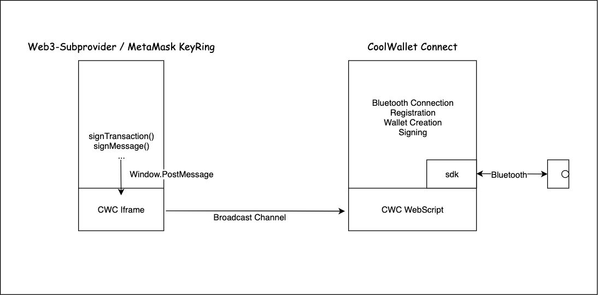

# CoolWallet Connect

A bridge connection page to relay signing commands to CoolWalletS device. Now hosted on [GitHub Page](https://coolbitx-technology.github.io/coolwallet-connect/).

This page is designed for easy integration with other signing protocol, for example: MetaMask Keyring or Web3 Subprovider.

## Architecture

## Security

### App Keys

In the design of CoolWalletS, we use digital signature to achieve access control in the secure element: only registered keypairs can ask the wallet to sign transactions, the integrity of command can also be checked with the signature.

As a result, we will generate a keypair and store it in the browser's **LocalStorage** when you first visit the website. If the localStorage is leaked, who every got the `appPrivateKey` can sign APDU commands to access your CoolWalletS and use it to sign arbitrary transaction.